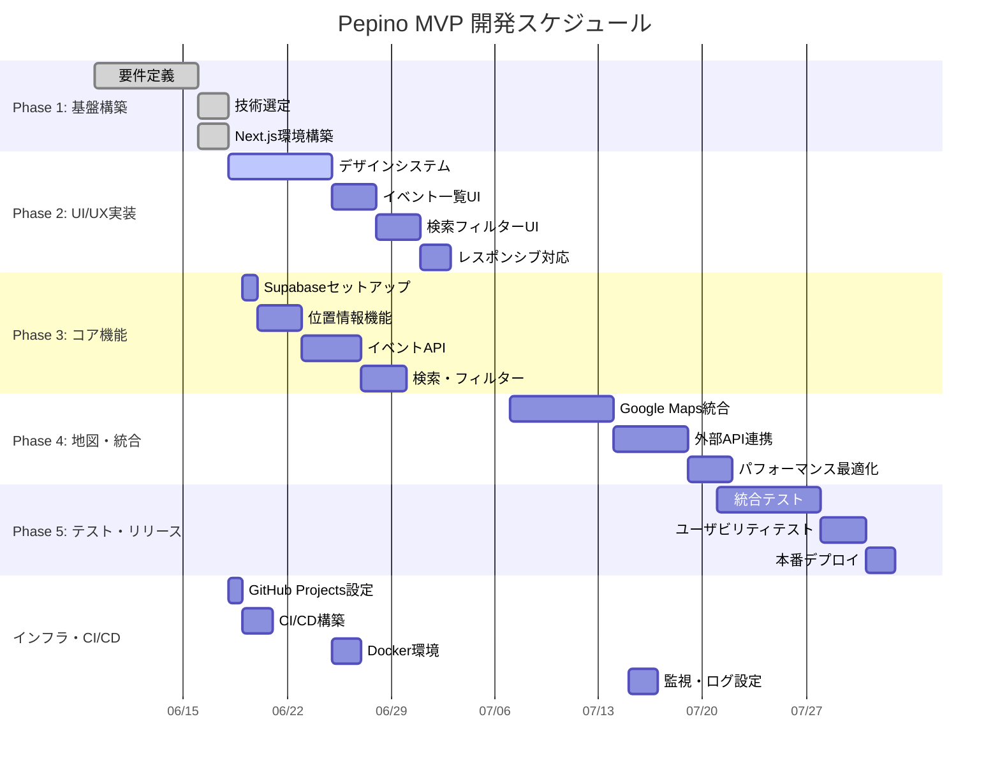

# 📊 Pepino MVP - ガントチャート

## 📅 プロジェクト期間
**開始**: 2025年6月9日  
**MVP完了予定**: 2025年8月31日（12週間）  
**現在日**: 2025年6月18日 ✅

---

## 📊 詳細ガントチャート



---

## 📈 進捗状況（2025/6/18時点）

### ✅ 完了フェーズ
- **Phase 1完了**: 要件定義・技術選定・環境構築 
- **進捗率**: 25%

### 🔄 進行中フェーズ  
- **Phase 2開始**: UI/UX実装・デザインシステム
- **今週の重点**: GitHub Projects + デザイン基盤

### ⏳ 今後の重要マイルストーン

| 📅 日付 | 🎯 マイルストーン | 📋 主要成果物 |
|---------|------------------|---------------|
| **6/25** | デザインシステム完成 | コンポーネント体系・スタイルガイド |
| **6/30** | **M2: UI実装完了** | 主要画面UI・レスポンシブ対応 |
| **7/14** | **M3: コア機能完成** | イベント表示・検索・位置情報 |
| **7/28** | **M4: 地図機能完成** | Google Maps・外部API連携 |
| **8/31** | **🚀 MVP リリース** | 本番デプロイ・ユーザーテスト |

---

## ⚡ クリティカルパス分析

### 🔴 **クリティカルパス**
```
デザインシステム → イベント一覧UI → 検索UI → API統合 → 地図機能 → リリース
```

**リスク**: デザインシステムの遅延が全体に影響

### 🟡 **準クリティカル**
```
Supabaseセットアップ → 位置情報機能 → 検索機能
```

**リスク**: データベース設定の複雑化

### 🟢 **並行作業可能**
```
GitHub Projects設定、CI/CD構築、Docker環境、ドキュメント整備
```

---

## 📊 週次計画詳細

### **Week 3 (6/18-6/24): インフラ + UI基盤**

| 日付 | タスク | 担当 | 工数 | 依存関係 |
|------|--------|------|------|----------|
| 6/18 | GitHub Projects設定 | kpab | 2h | - |
| 6/19 | Supabaseセットアップ | kpab | 3h | - |
| 6/20 | EventCard実装 | kpab | 4h | デザインシステム |
| 6/21 | CI/CD基本設定 | kpab | 3h | GitHub Projects |
| 6/22 | EventList実装 | kpab | 4h | EventCard |
| 6/23 | 統合テスト | kpab | 2h | EventList |

**Week 3目標**: GitHub Projects運用開始 + イベント一覧基本機能

### **Week 4 (6/25-7/1): 検索・フィルター**

| タスク | 工数 | 優先度 |
|--------|------|--------|
| 検索フィルターUI | 6h | High |
| カテゴリ選択機能 | 4h | High |
| 距離フィルター | 4h | Medium |
| レスポンシブ調整 | 2h | Medium |

**Week 4目標**: 基本的な検索・フィルター機能完成

---

## 🎯 リソース配分

### **開発工数配分** (週30時間想定)

```
UI/UX実装:     40% (12h/週)
バックエンド:  30% (9h/週)
インフラ:     20% (6h/週)
テスト・調整:  10% (3h/週)
```

### **技術学習時間**

| 技術領域 | 学習時間/週 | 重要度 |
|----------|-------------|--------|
| PostGIS・地理的検索 | 2h | High |
| Google Maps API | 2h | High |
| Supabase機能 | 1h | Medium |
| PWA・パフォーマンス | 1h | Low |

---

## 🚨 リスク・遅延対策

### **スケジュール遅延リスク**

| リスク | 確率 | 影響 | 対策 |
|--------|------|------|------|
| Google Maps料金問題 | 中 | 高 | Mapbox代替案準備 |
| UI実装の複雑化 | 高 | 中 | 段階的リリース・MVP簡素化 |
| 外部API仕様変更 | 低 | 高 | モックデータでの並行開発 |

### **品質リスク対策**

```
- 毎週金曜: 統合テスト実施
- 各フェーズ完了時: ユーザビリティ確認
- M4完了時: パフォーマンステスト
```

---

## 📱 GitHub Projects連携

### **自動化設定**

```yaml
# .github/workflows/project-automation.yml
name: Project Automation
on:
  issues:
    types: [opened, closed]
  pull_request:
    types: [opened, merged, closed]

jobs:
  update-project:
    runs-on: ubuntu-latest
    steps:
      - name: Update project board
        uses: actions/add-to-project@v0.5.0
        with:
          project-url: https://github.com/users/kpab/projects/1
          github-token: ${{ secrets.PROJECT_TOKEN }}
```

### **進捗レポート自動化**

```yaml
# 毎週月曜日に進捗レポート生成
name: Weekly Progress Report
on:
  schedule:
    - cron: '0 9 * * MON'  # 毎週月曜9時

jobs:
  generate-report:
    runs-on: ubuntu-latest
    steps:
      - name: Generate progress report
        run: |
          # GitHub API で Issues/PRs 取得
          # Mermaidガントチャート更新
          # Slack/メール通知
```

---

## 🔄 更新履歴

| 日付 | 更新内容 | 進捗率 |
|------|----------|--------|
| 2025/6/18 | 詳細ガントチャート作成、GitHub Projects設定追加 | 25% |

**次回更新**: 毎週月曜日（進捗反映・スケジュール調整）
