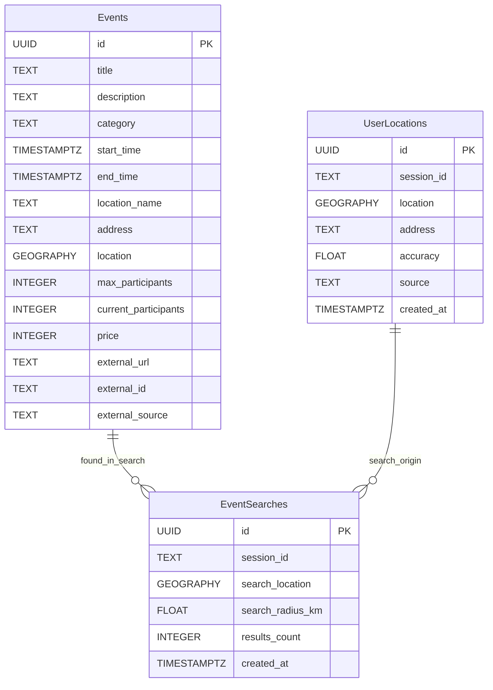

# 🗄️ Pepino - データベース設計

## 📋 概要
Pepinoアプリケーションのデータベース論理設計

### 🛠️ 技術選定
- **DBMS**: PostgreSQL 15.x (Supabase管理)
- **拡張**: PostGIS (地理的検索)
- **選定理由**: [技術選定記録](../project-management/decisions#adr-001) 参照

---

## 🎯 データモデル設計方針

### 設計原則
1. **位置情報中心**: PostGIS地理的データ型を活用
2. **リアルタイム対応**: Supabaseリアルタイム機能活用
3. **外部API連携**: connpass等のデータ統合
4. **プライバシー重視**: 最小限のユーザーデータ保持

### パフォーマンス要件
- 近傍検索: &lt;500ms (5km圏内、1000件)
- イベント一覧: &lt;200ms
- 位置情報更新: &lt;100ms

---

## 📊 エンティティ関係図



---

## 📋 テーブル設計

### 1. `events` - イベント情報

**概要**: アプリのメインエンティティ。オフラインイベントの全情報を格納

| カラム名 | 型 | 制約 | 説明 |
|----------|----|----- |------|
| id | UUID | PK | 一意識別子 |
| title | TEXT | NOT NULL | イベント名 |
| description | TEXT | NULL | 詳細説明 |
| category | TEXT | NOT NULL, CHECK | カテゴリ（tech, cultural等） |
| start_time | TIMESTAMPTZ | NOT NULL | 開始時刻 |
| end_time | TIMESTAMPTZ | NOT NULL | 終了時刻 |
| location_name | TEXT | NOT NULL | 会場名 |
| address | TEXT | NOT NULL | 住所 |
| location | GEOGRAPHY(POINT) | NOT NULL | PostGIS地理座標 |
| max_participants | INTEGER | NULL | 定員（NULL=無制限） |
| current_participants | INTEGER | DEFAULT 0 | 現在参加者数 |
| price | INTEGER | DEFAULT 0 | 料金（円） |
| currency | TEXT | DEFAULT 'JPY' | 通貨 |
| tags | TEXT[] | DEFAULT '{}' | タグ配列 |
| image_url | TEXT | NULL | イベント画像URL |
| external_url | TEXT | NULL | 元サイトURL |
| external_id | TEXT | NULL | 外部API ID |
| external_source | TEXT | NULL | データソース名 |
| organizer_name | TEXT | NULL | 主催者名 |
| organizer_contact | TEXT | NULL | 主催者連絡先 |
| is_online | BOOLEAN | DEFAULT FALSE | オンライン開催フラグ |
| created_at | TIMESTAMPTZ | DEFAULT NOW() | 作成日時 |
| updated_at | TIMESTAMPTZ | DEFAULT NOW() | 更新日時 |

**ビジネスルール**:
- Pepinoは `is_online = FALSE` のイベントのみ表示
- `start_time` が現在時刻+2時間以内は「今すぐ参加可能」
- 地理的検索は `location` カラムを使用

### 2. `user_locations` - ユーザー位置履歴

**概要**: セッションベースの位置情報履歴（ユーザー登録なしでも利用可能）

| カラム名 | 型 | 制約 | 説明 |
|----------|----|----- |------|
| id | UUID | PK | 一意識別子 |
| session_id | TEXT | NOT NULL | セッション識別子 |
| location | GEOGRAPHY(POINT) | NOT NULL | 位置座標 |
| address | TEXT | NULL | 住所（逆ジオコーディング結果） |
| accuracy | FLOAT | NULL | GPS精度（メートル） |
| source | TEXT | CHECK | 取得方法（gps/manual/ip） |
| created_at | TIMESTAMPTZ | DEFAULT NOW() | 取得日時 |

**プライバシー配慮**:
- 7日間で自動削除
- セッションIDベース（個人特定情報なし）
- 正確な住所は保存しない

### 3. `event_searches` - 検索ログ

**概要**: 検索パフォーマンス分析・最適化用

| カラム名 | 型 | 制約 | 説明 |
|----------|----|----- |------|
| id | UUID | PK | 一意識別子 |
| session_id | TEXT | NOT NULL | セッション識別子 |
| search_location | GEOGRAPHY(POINT) | NULL | 検索基点 |
| search_radius_km | FLOAT | DEFAULT 5 | 検索半径 |
| category_filter | TEXT[] | NULL | カテゴリフィルター |
| results_count | INTEGER | NULL | 結果件数 |
| response_time_ms | INTEGER | NULL | レスポンス時間 |
| created_at | TIMESTAMPTZ | DEFAULT NOW() | 検索日時 |

---

## 🔍 主要検索パターン

### 1. 近傍イベント検索
```
入力: ユーザー位置(lat, lng) + 半径 + フィルター
処理: PostGIS ST_DWithin関数で地理的検索
出力: 距離順・時間順ソートのイベント一覧
```

### 2. 「今すぐ」参加可能検索
```
条件: 現在時刻 < start_time <= 現在時刻+2時間
優先度: 「今すぐ」 > 距離 > 開始時間
```

### 3. カテゴリ・タグ検索
```
フィルター: category IN (選択リスト)
拡張: tags配列での部分一致
```

---

## 📈 容量・パフォーマンス設計

### MVP期見積もり

| データ種別 | 件数 | サイズ/件 | 合計 | 備考 |
|------------|------|-----------|------|------|
| イベント | 1,000件 | 2KB | 2MB | 外部API取得分含む |
| 位置履歴 | 10,000件 | 200B | 2MB | 7日間ローテーション |
| 検索ログ | 50,000件 | 300B | 15MB | 30日間保持 |
| インデックス | - | - | 30MB | 地理的インデックス重い |
| **合計** | | | **約50MB** | Supabase無料枠内 |

### インデックス戦略

| インデックス | 用途 | 重要度 |
|-------------|------|--------|
| GIST(location) | 地理的検索 | ★★★ |
| start_time | 時間フィルター | ★★★ |
| category | カテゴリ検索 | ★★ |
| (external_id, external_source) | 重複防止 | ★★ |

### パフォーマンス目標

| 操作 | 目標時間 | 条件 |
|------|----------|------|
| 近傍検索 | &lt;500ms | 5km圏内、100件 |
| イベント詳細 | &lt;100ms | 単一レコード |
| 位置情報更新 | &lt;200ms | INSERT処理 |

---

## 🔐 セキュリティ設計

### Row Level Security (RLS)
- **イベント**: 全員読み取り可能（パブリックデータ）
- **位置情報**: セッションIDでの制限アクセス
- **検索ログ**: セッションIDでの制限アクセス

### プライバシー保護
- 位置情報の自動削除（7日後）
- 個人識別情報の最小化
- セッションベース管理

---

## 🌐 外部データ統合

### Connpass API統合
- **データマッピング**: Connpass → 標準スキーマ
- **重複検出**: external_id + タイトル + 位置での判定
- **更新戦略**: 日次バッチ同期

### 将来の拡張
- Doorkeeper、Peatix等の他プラットフォーム
- 手動イベント作成機能
- イベント主催者アカウント

---

## 📚 関連ドキュメント

- **実装詳細**: [データベース実装ガイド](../development/database-implementation)
- **セットアップ**: [開発環境構築](../development/setup)
- **技術選定**: [ADR-001](../project-management/decisions#adr-001)

---

## 🔄 更新履歴

| 日付 | 変更内容 | 更新者 |
|------|----------|--------|
| 2025/6/18 | 初版作成（論理設計） | Claude |

次回更新: UI設計との整合性確認時
