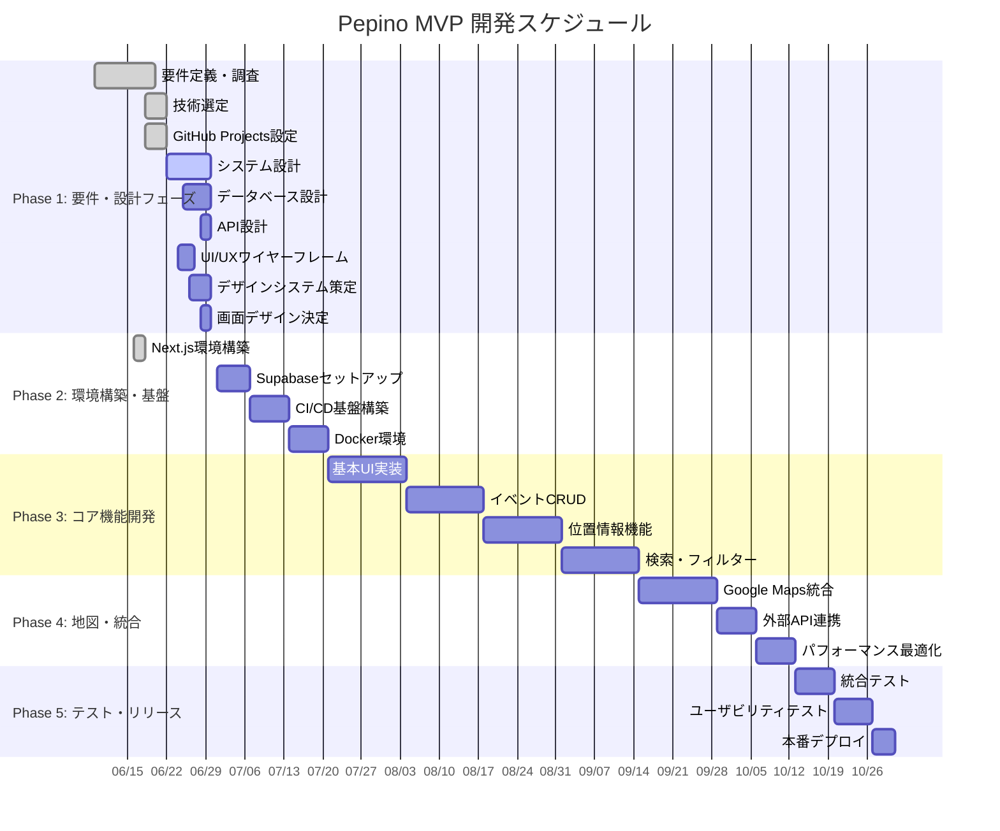

# 📊 Pepino MVP - ガントチャート

## 📅 プロジェクト期間
**開始**: 2025年6月9日  
**MVP完了予定**: 2025年10月31日（約20週間）  
**現在日**: 2025年6月22日 ✅

---

## 📊 詳細ガントチャート



---

## 📈 進捗状況（2025/6/22時点）

### ✅ 完了フェーズ
- **要件定義・調査**: 完了
- **技術選定**: 完了  
- **GitHub Projects設定**: 完了
- **Next.js環境構築**: 完了
- **進捗率**: 20%

### 🔄 進行中フェーズ  
- **Phase 1続行**: システム設計・データベース設計・API設計
- **今週の重点**: 設計ドキュメント完成

### ⏳ 今後の重要マイルストーン

| 📅 日付 | 🎯 マイルストーン | 📋 主要成果物 |
|---------|------------------|---------------|
| **6/30** | **M1: 設計完了** | システム・DB・API設計書 |
| **7/21** | **M2: 基盤構築完了** | Supabase・CI/CD・Docker |
| **8/18** | **M3: コア機能完成** | イベントCRUD・UI基盤 |
| **9/29** | **M4: 地図機能完成** | Google Maps・外部API連携 |
| **10/31** | **🚀 MVP リリース** | 本番デプロイ・ユーザーテスト |

---

## ⚡ クリティカルパス分析

### 🔴 **クリティカルパス**
```
デザインシステム → イベント一覧UI → 検索UI → API統合 → 地図機能 → リリース
```

**リスク**: デザインシステムの遅延が全体に影響

### 🟡 **準クリティカル**
```
Supabaseセットアップ → 位置情報機能 → 検索機能
```

**リスク**: データベース設定の複雑化

### 🟢 **並行作業可能**
```
GitHub Projects設定、CI/CD構築、Docker環境、ドキュメント整備
```

---

## 📊 週次計画詳細

### **Week 3 (6/22-6/29): 設計フェーズ完了**

| 日付 | タスク | 担当 | 工数 | 依存関係 |
|------|--------|------|------|----------|
| 6/22 | GitHub Projects設定完了 | kpab | 1h | - |
| 6/23 | システムアーキテクチャ設計 | kpab | 4h | - |
| 6/24 | UI/UXワイヤーフレーム作成 | kpab | 4h | システム設計 |
| 6/25 | データベーススキーマ設計 | kpab | 4h | システム設計 |
| 6/26 | デザインシステム策定 | kpab | 4h | ワイヤーフレーム |
| 6/27 | API仕様書作成 | kpab | 4h | DB設計 |
| 6/28 | 画面デザイン決定 | kpab | 4h | デザインシステム |
| 6/29 | 設計統合・最終調整 | kpab | 3h | 全設計 |

**Week 3目標**: 6月末までに全設計完了

### **Week 4 (7/1-7/7): 基盤構築開始**

| タスク | 工数 | 優先度 |
|--------|------|--------|
| Supabaseプロジェクト作成 | 3h | High |
| データベーステーブル作成 | 4h | High |
| 認証システム基盤 | 4h | High |
| API基本構造実装 | 5h | Medium |

**Week 4目標**: データベース・認証基盤完成

---

## 🎯 リソース配分

### **開発工数配分** (週30時間想定)

```
UI/UX実装:     40% (12h/週)
バックエンド:  30% (9h/週)
インフラ:     20% (6h/週)
テスト・調整:  10% (3h/週)
```

### **技術学習時間**

| 技術領域 | 学習時間/週 | 重要度 |
|----------|-------------|--------|
| PostGIS・地理的検索 | 2h | High |
| Google Maps API | 2h | High |
| Supabase機能 | 1h | Medium |
| PWA・パフォーマンス | 1h | Low |

---

## 🚨 リスク・遅延対策

### **スケジュール遅延リスク**

| リスク | 確率 | 影響 | 対策 |
|--------|------|------|------|
| Google Maps料金問題 | 中 | 高 | Mapbox代替案準備 |
| UI実装の複雑化 | 高 | 中 | 段階的リリース・MVP簡素化 |
| 外部API仕様変更 | 低 | 高 | モックデータでの並行開発 |

### **品質リスク対策**

```
- 毎週金曜: 統合テスト実施
- 各フェーズ完了時: ユーザビリティ確認
- M4完了時: パフォーマンステスト
```

---

## 📱 GitHub Projects連携

### **自動化設定**

```yaml
# .github/workflows/project-automation.yml
name: Project Automation
on:
  issues:
    types: [opened, closed]
  pull_request:
    types: [opened, merged, closed]

jobs:
  update-project:
    runs-on: ubuntu-latest
    steps:
      - name: Update project board
        uses: actions/add-to-project@v0.5.0
        with:
          project-url: https://github.com/users/kpab/projects/1
          github-token: ${{ secrets.PROJECT_TOKEN }}
```

### **進捗レポート自動化**

```yaml
# 毎週月曜日に進捗レポート生成
name: Weekly Progress Report
on:
  schedule:
    - cron: '0 9 * * MON'  # 毎週月曜9時

jobs:
  generate-report:
    runs-on: ubuntu-latest
    steps:
      - name: Generate progress report
        run: |
          # GitHub API で Issues/PRs 取得
          # Mermaidガントチャート更新
          # Slack/メール通知
```

---

## 🔄 更新履歴

| 日付 | 更新内容 | 進捗率 |
|------|----------|--------|
| 2025/6/18 | 詳細ガントチャート作成、GitHub Projects設定追加 | 25% |

**次回更新**: 毎週月曜日（進捗反映・スケジュール調整）
